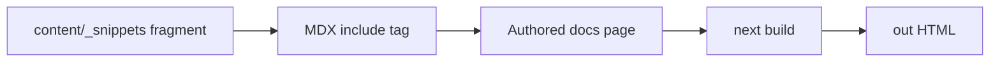

## Overview

Use snippets when maintainers need one local source of truth for repeated prose, parameters, examples, or responses that appear across multiple docs 
pages during the Fumadocs build.

<Callout type="warn">
If your site generates `llms.txt` or `llms-full.txt`, make sure that generation reads processed Markdown so `<include>` content is expanded before the
LLM text is written.
</Callout>

## How it works

<Callout type="success">

<include>../../../_snippets/example.mdx</include>

</Callout>

Fumadocs can inline MDX fragments through `<include>` tags. The template already enables processed Markdown output in `source.config.ts`, which 
supports build-time content processing for features such as snippet inclusion.



## Create a snippet folder

Consider keeping snippets outside of `content/docs/` to separate concerns. Use _ for folder names to ensure they do not become routed pages.

```text
content/
├── _snippets/
│   ├── _load-model-description.mdx
│   ├── _load-model-parameters.mdx
│   └── _load-model-example.mdx
└── docs/
    └── references/
        └── load-model.mdx
```

Use a leading underscore for snippet files so maintainers can recognize non-page content.

## Write focused snippets

Keep each snippet small and reusable. Do not add page frontmatter to snippet files.

```mdx
The `loadModel()` function loads a model into memory and returns a model identifier for later inference calls.
```

For example snippets, keep the imported code self-contained enough to read in every page that includes it.

````mdx
```ts
import { loadModel } from '@qvac/sdk';

const modelId = await loadModel({
  modelType: 'llm',
});
```
````

## Include snippets from a page

Use a relative path from the consuming page to the snippet file.

```mdx
---
title: loadModel
description: Reference page for loading a model.
schemaType: APIReference
docType: reference
---

<include>../../_snippets/_load-model-description.mdx</include>

## Parameters

<include>../../_snippets/_load-model-parameters.mdx</include>

## Example

<include>../../_snippets/_load-model-example.mdx</include>
```

The proven `f-doc-play` example composes an API page from description, parameters, returns, request, and response snippets.


## Choose snippets or public sourcing

Use snippets for reusable local fragments owned by this docs site. They may also be used to leverage content materialized from public sources into the 
snippets folder for use in this repo's pages as an alternative to [using stubs and importing public content into local pages](/how-tos/single-source/source-public-docs-with-stubs).
